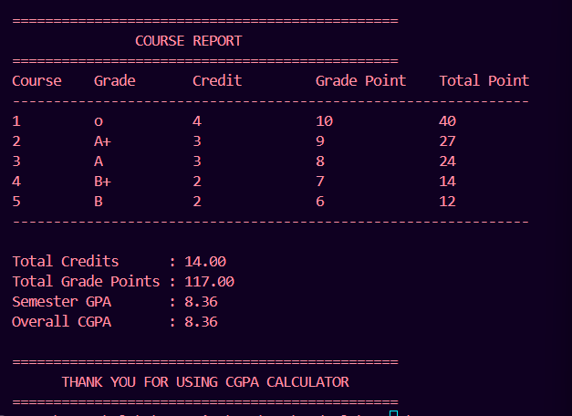

# 🎓 Task 1 - CGPA Calculator

## 📌 Objective

Develop a **CGPA Calculator** using **C++** that calculates the Semester GPA and Overall CGPA based on the grades and credit hours entered by the user.

---

## ✨ Features

- Accepts the number of courses from the user.
- Takes grade and credit hours for each course.
- Converts grades into grade points.
- Calculates total credits.
- Calculates total grade points.
- Computes Semester GPA.
- Displays Overall CGPA.
- Shows individual course details in a formatted table.
- User-friendly console interface.

---

## 🛠️ Technologies Used

- C++
- Visual Studio Code
- Git & GitHub

---

## 📂 Project Structure

```
Task1_CGPA_Calculator/
│── main.cpp
│── README.md
│── Output.png
```

---

## ▶️ How to Run

### Compile

```bash
g++ main.cpp -o cgpa
```

### Run

```bash
./cgpa
```

> **Windows (MinGW)**

```bash
g++ main.cpp -o cgpa.exe
cgpa.exe
```

---

## 📝 Sample Input

```
Enter Number of Courses : 5

Course 1
Grade : O
Credit Hours : 4

Course 2
Grade : A+
Credit Hours : 3

Course 3
Grade : A
Credit Hours : 3

Course 4
Grade : B+
Credit Hours : 2

Course 5
Grade : B
Credit Hours : 2
```

---

## 📊 Sample Output

```
Total Credits      : 14
Total Grade Points : 117
Semester GPA       : 8.36
Overall CGPA       : 8.36
```

---

## 📸 Output Screenshot

> Add your program output screenshot as **Output.png** in this folder.



---

## 🚀 Learning Outcomes

- C++ Functions
- Conditional Statements
- Loops
- Arrays / Vectors
- User Input & Output
- GPA & CGPA Calculation Logic
- Formatted Console Output

---

## 👨‍💻 Author

**Alok Yadav**

- B.Tech CSE Student
- Kamla Nehru Institute of Technology (KNIT), Sultanpur
- CodeAlpha C++ Programming Intern

---

## ⭐ Internship Task

This project was developed as **Task 1** for the **CodeAlpha C++ Programming Internship**.

If you found this project helpful, don't forget to ⭐ star the repository.